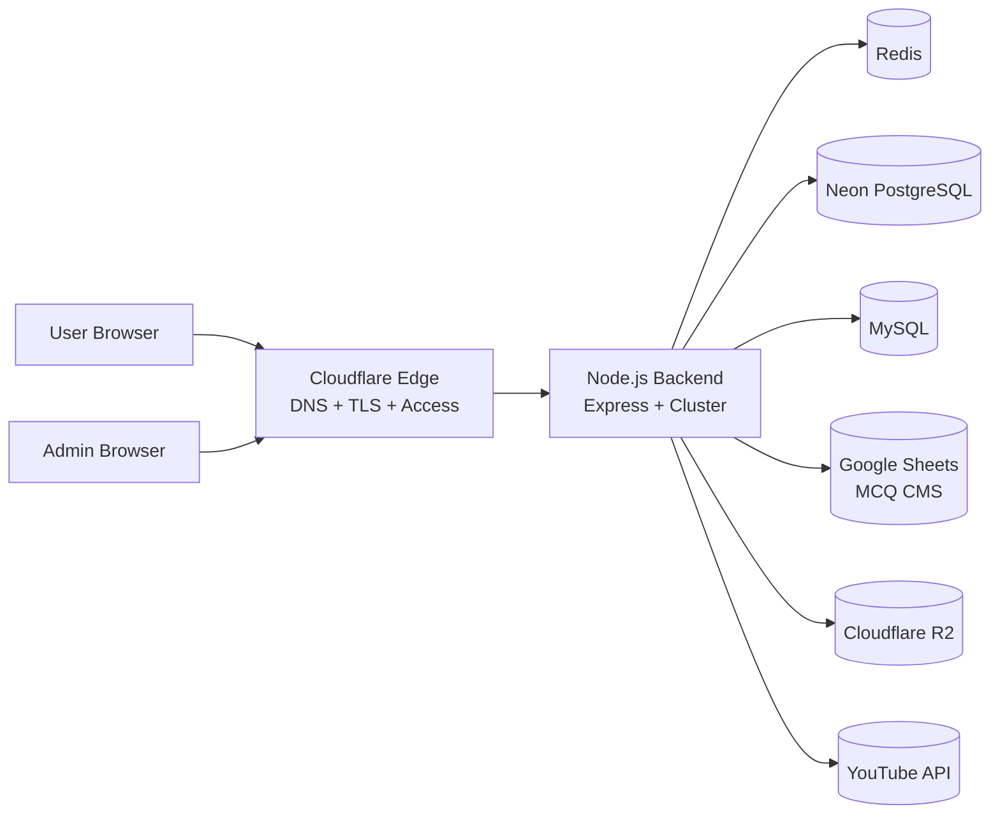
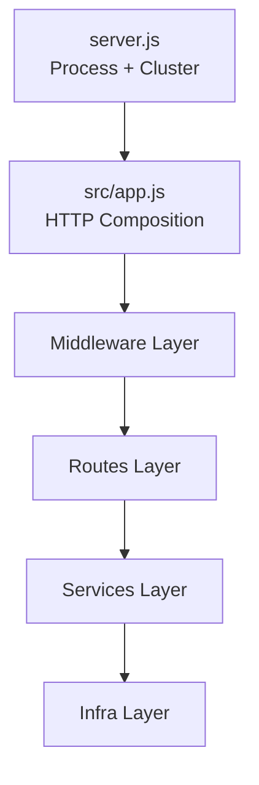
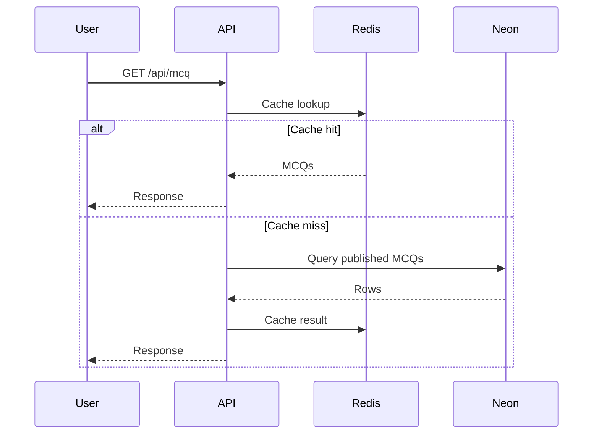
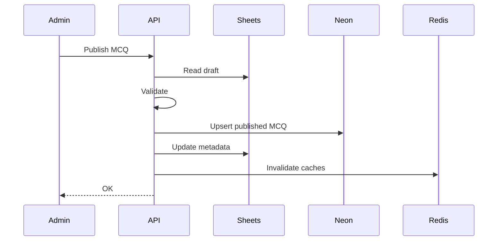
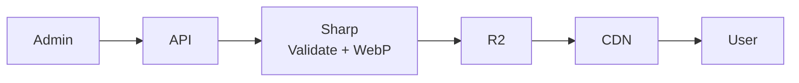
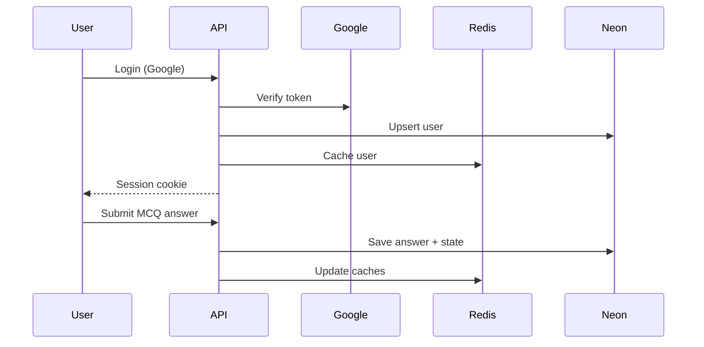

# System Architecture

This document describes the **high-level architecture** of the Bench to Bedside Neuro / Axon IQ backend.

---

## 1. High-Level System Overview

---

## 2. Backend Internal Layering

---

## 3. Public MCQ Read Flow

---

## 4. MCQ Publish Pipeline

---

## 5. Media Upload Pipeline

---

## 6. Authentication & Progress Flow

